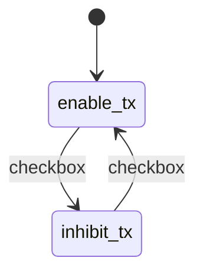
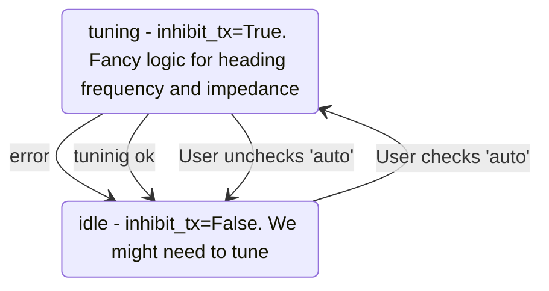
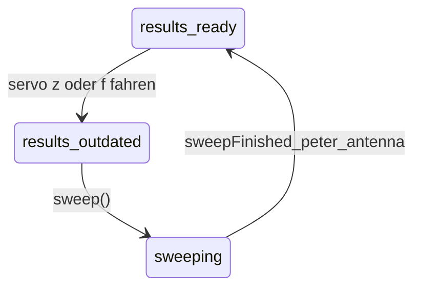
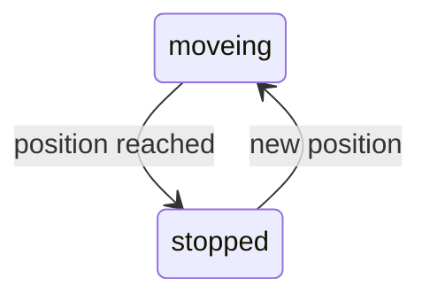
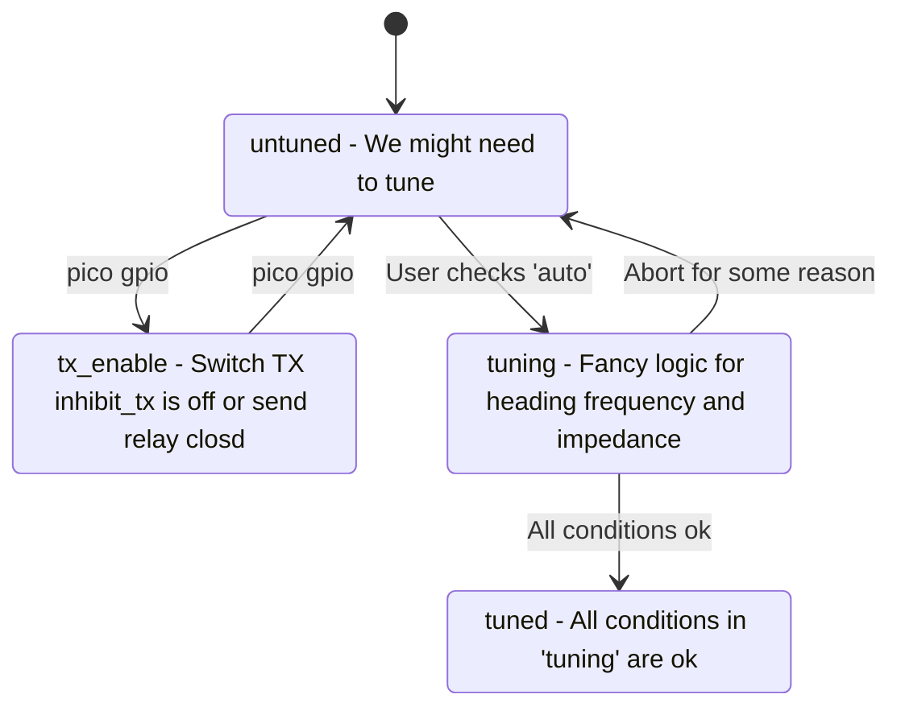
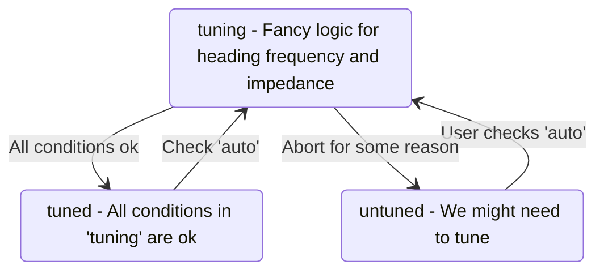

# Gui draft
DONE Tune checkbox
DONE VNA enable, TX inhibit checkbox

Tune heading checkbox
Tune heading target textfeld, button set
Tune heading current textfeld
Tune heading servo_h textfeld, button set

Frequency enable checkbox
Frequency Offset textfeld mit button set
Frequency auto get from TX checkbox
Frequency TX textfeld mit button set
Frequency target textfeld
Frequency current textfeld
Frequency servo_f textfeld button set

Impedance enable checkbox
Impedance target textfeld mit button set
Impedance current textfeld
Impedance servo_z textfeld button set

# Servo Ansteuerung

- f, mehrere Umdrehungen wie gehabt
- heading: float, kein rundherum

# States

* enable_tx

  * inhibit_tx=False,VNAenable=False, servo_power=True.

* inhibit_tx

  * inhibit_tx=True,VNAenable=True, servo_power=False.

* idle entry action: State `enable_tx`
* tuning entry action: State `inhibit_tx`

# servo

Implementation: Blocks GUI while moveing

