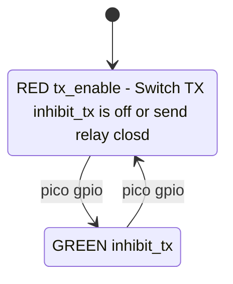
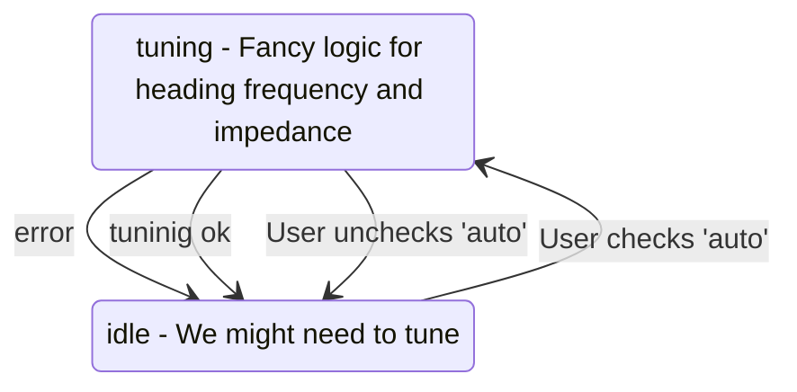
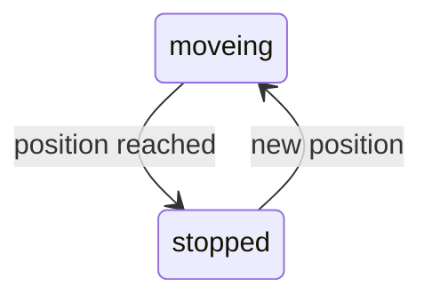
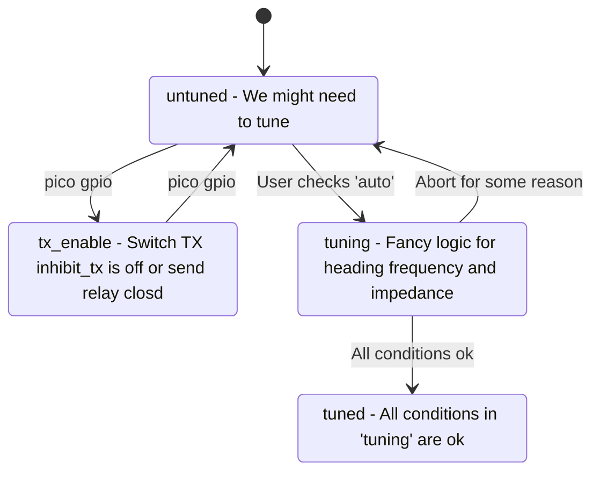
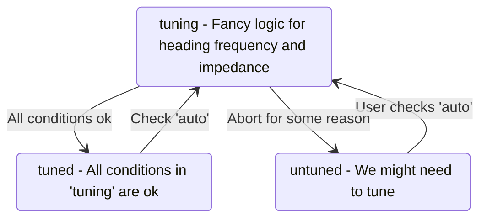

# Gui draft
Tune checkbox
VNA enable, TX inhibit checkbox
Tune heading checkbox
Tune heading target textfeld, button set
Tune heading current textfeld
Tune heading servo_h textfeld, button set

Frequency enable checkbox
Frequency Offset textfeld mit button set
Frequency auto get from TX checkbox
Frequency TX textfeld mit button set
Frequency target textfeld
Frequency servo_f textfeld button set

Impedance enable checkbox
Impedance target textfeld mit button set
Impedance target current textfeld
Impedance servo_z textfeld button set

# Servo Ansteuerung

- f, mehrere Umdrehungen wie gehabt
- heading: float, kein rundherum

# States

GREEN `inhibit_tx` substate

# servo

Implementation: Blocks GUI while moveing

